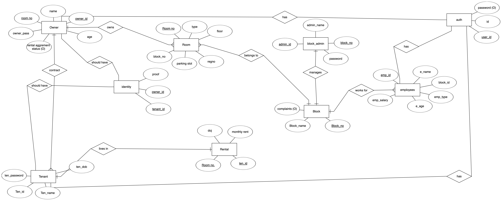
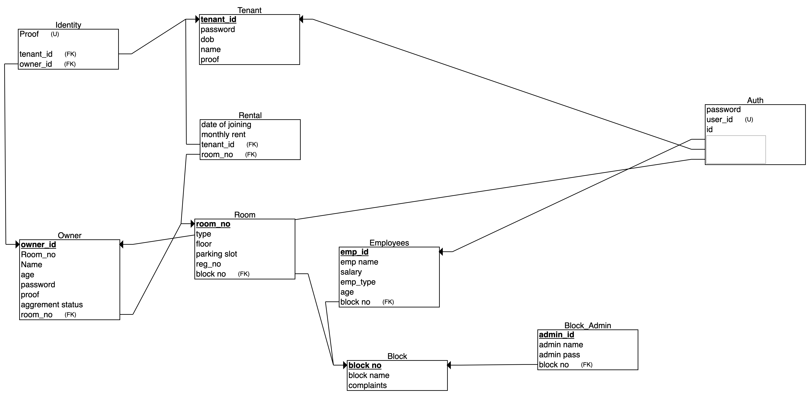
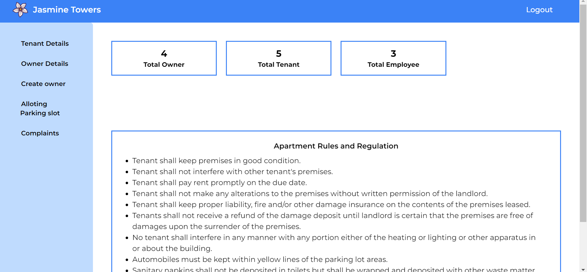
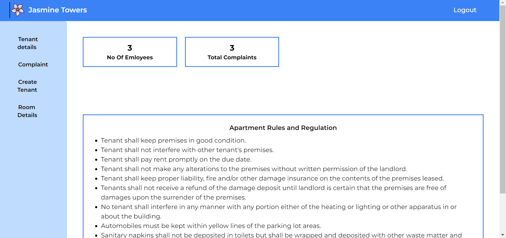
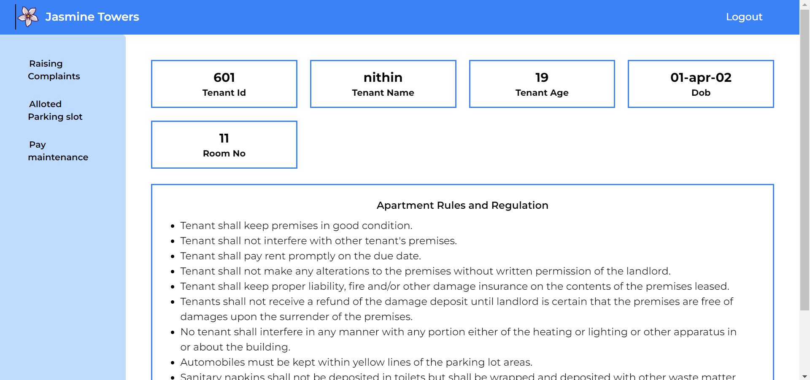
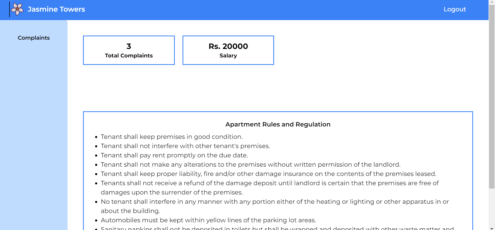

# Apartment Management System

We created this project as a part of Database Management System Course.
# Contents
- Project Description
- Basic Structure
  - Functionalities
  - ER Diagram
  - Database Schema
  - Screenshots of the Interface
- Tech Stack
- How to Run
- Contributors

# Project Description

In this project we created a Apartment management system with user interface and database support.This project is a part of our curriculum, here we solved the problem of manual entry of data in apartments by creating user interface and storing data in mysql database.

# Basic Structure

## Functionalities

- Admin
  - Admin can login.
  - Admin can view the tenant and owner details.
  - Admin can create owner.
  - Admin can allot parking slot.
  - Admin can view the complaints.
  - Admin can see total Owners.
  - Admin can see total Tenants.
  - Admin can see total Employee.
- Owner
  - Owner can see the Tenant details of his/her owned room.
  - Owner can create Tenant.
  - Owner can see the complaints from his/her owned room.
  - Owner can see the Room Details.
  - Owner can see Total Complaint.
  - Owner can see Number of Employee.
- Tenant

  - Tenant can see the alloted parking slot.
  - Tenant can pay maintenance fee.
  - Tenant can raise complaints.
  - Tenant can see his/her Tenant id.
  - Tenant can see his/her Name.
  - Tenant can see his/her Age.
  - Tenant can see his/her DOB.
  - Tenant can see his/her Room no.

- Employee

  - Employee can see all the complaints.
  - Employee can see Total number of Complaints

- All the admins, owners, tenant, employees can login and logout.

## ER Diagram

<kbd></kbd>

## Database Schema

<kbd></kbd>

## Screenshots of the Implementation

### Admin dashboard

<kbd></kbd>

### Owner dashboard

<kbd></kbd>

### Tenant dashboard

<kbd></kbd>

### Employee dashboard

<kbd></kbd>

# Tech Stack

- Frontend - HTML5, Tailwind css, React JS
- Backend - NodeJS, ExpressJS
- Database - MySql

# How to Run

- First, clone the github repo
- Then, install the dependencies by opening the terminal with path as that of cloned github folder and do the following

  - For Client side, cd client

          npm install

  - For Server side, cd server

          npm install

- Install MySql workbench if you don't have one, and then import the export.sql file under database folder in workbench.

- Then in server folder create a file "config_sql.js" add localhost name, database name, username and password of your sql workbench and export it.

- Now to run, type the following

  - For client,

          npm run start

  - For sever,
    npm run start

- Now, you can use the project.

# Contributors

<table>
  <tr>
    <td align="center"><a href="https://github.com/Suryah07"> <b>D K Suryah </b></a> </td>
    <td align="center"><a href="https://github.com/imtharun"> <b>Tharunprasath A S</b></a> </td>
    <td align="center"><a href="https://github.com/yuvarraj-sriramkumar"> <b>Yuvarraj S</b></a> </td>
    <td align="center"><a href="https://github.com/shivsrith03"> <b>Shivanesh S</b></a> </td>

  </tr>
</table>

`Thank you!🧑‍💻`
